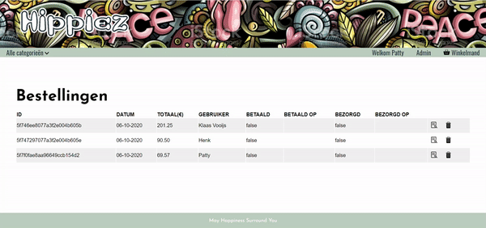

# Hippiez
A fully functional e-commerce website created for a company that sells products for a healthy mind and body. 

### Technologies used
* React
* Redux
* NodeJs
* Express
* MongoDB

### Homepage and user login

### Place an order

### Customer order

### Send item

### Add item

This project was bootstrapped with [Create React App](https://github.com/facebook/create-react-app).
In the project directory, you can run:

### `npm start`

Runs the app in the development mode. 
Open [http://localhost:3000](http://localhost:3000) to view it in the browser.